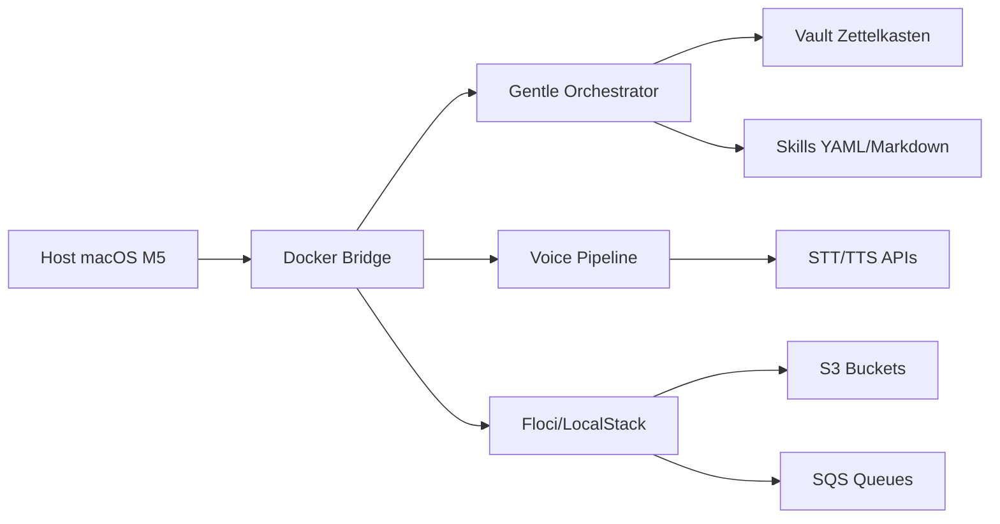

# jarvis-os

**Sistema Operativo Personal orquestado por voz y Markdown**  
Software Libre bajo la **GNU General Public License v3.0**

## Arquitectura general

jarvis-os se ejecuta como una pila de contenedores Docker en macOS Apple Silicon M5, compuesta por tres servicios principales:

- **Gentle Orchestrator**: núcleo de orquestación que coordina skills, vault y adaptadores.
- **Voice Pipeline**: servidor STT/TTS para entrada y salida por voz.
- **Floci/LocalStack**: emulación de AWS S3/SQS para persistencia en frío y colas de eventos.

## Licencia

Este proyecto es Software Libre bajo los términos de la **GNU General Public License v3.0**.  
Ver [LICENSE](../LICENSE) para más detalles.
